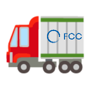

# Bob the Tracker

A web-based dataset request tracking system for centrally produced datasets
used in analysis, detector design studies, and other physics related areas at
the [Future Circular Collider (FCC)](https://fcc.web.cern.ch/).

Bob keeps an eye on the dataset needs of the community around the FCC and makes
sure nothing falls through the cracks.

<p align="center"></p>

---

## Features

- **Submit requests** for FCC datasets with HEP-specific fields (dataset stage, use case, format, tags)
- **Track status** through the full pipeline: Draft → Pending Review → Approved → In Progress → Completed
- **Priority levels** — Low, Medium, High, Critical — with dashboard alerts for critical requests
- **Pipeline view** for managers: assignment, batch actions, inline status and priority overrides
- **Activity log** per request: comments, internal manager notes, system events with timestamps
- **Assignment** of requests to managers with dropdown selector
- **Batch actions** — approve, reject, complete, or move to in-progress across multiple requests at once
- **Filter & search** by status, priority, or free text
- **Bento-style dashboard** with live stats (total, pending, in-progress, completed)
- **Markdown + LaTeX math** rendering in titles and descriptions (KaTeX + marked.js)
- **Email notifications** on status changes (optional, via SMTP)
- **Dark / light / system** theme with persistent preference
- **Responsive design** — works on desktop and mobile

---

## Tech Stack

| Layer     | Technology                              |
|-----------|-----------------------------------------|
| Backend   | Go 1.22+ (`net/http` standard library)  |
| Frontend  | HTMX 2 + Tailwind CSS (CDN)             |
| Database  | SQLite (`modernc.org/sqlite`, no CGO)   |
| Auth      | CERN SSO via OpenID Connect (Keycloak)  |
| Math/MD   | KaTeX + marked.js (CDN)                 |
| Email     | Go stdlib `net/smtp`                    |

Single binary, no CGO required.

---

## Getting Started

### Prerequisites

- Go 1.22 or later

### Local development (dev mode)

CERN SSO is bypassed in dev mode. A simple form lets you pick any username and role — no credentials required.

```bash
git clone https://github.com/kjvbrt/bob
cd bob
DEV_MODE=TRUE go run ./cmd/bob
```

Open **http://localhost:5050**, enter a username, choose a role (requester or manager), and log in.

### Production (CERN SSO)

Register the application at the [CERN Application Portal](https://application-portal.web.cern.ch) to obtain a client ID and secret, then:

```bash
export OIDC_CLIENT_ID=your-client-id
export OIDC_CLIENT_SECRET=your-client-secret
export OIDC_REDIRECT_URL=https://your-host/auth/callback
export MANAGER_USERNAMES=jsmith,adoe        # comma-separated CERN usernames

go run ./cmd/bob
```

### Build

```bash
go build -o bob ./cmd/bob
./bob
```

The server starts on **http://localhost:5050**. The SQLite database is created automatically at `./data/requests.db` on first run.

### Email notifications (optional)

Set the following environment variables to enable email notifications on status changes:

```bash
export SMTP_HOST=smtp.cern.ch
export SMTP_PORT=587
export SMTP_USER=your-username
export SMTP_PASS=your-password
export SMTP_FROM=bob@cern.ch
```

If not set, email is silently disabled.

---

## Authentication & Roles

Authentication uses **CERN SSO** (Keycloak / OpenID Connect). Requester identity (name, username, email) is always taken from SSO and cannot be edited by users.

| Role          | Permissions |
|---------------|-------------|
| **Requester** | Submit requests, view all requests, edit own requests while draft or pending, add comments |
| **Manager**   | Everything above + change status/priority on any request, assign requests, delete requests, batch actions, internal notes |

Role assignment:
- CERN usernames listed in `MANAGER_USERNAMES` receive the **manager** role on first login
- All other authenticated users receive the **requester** role
- Roles are stored in the local database and persist across logins

---

## Project Structure

```
bob/
├── cmd/
│   └── bob/
│       └── main.go               # Server entry point, routing
├── internal/
│   ├── auth/
│   │   └── oidc.go               # CERN SSO OIDC client
│   ├── db/
│   │   └── db.go                 # SQLite init & migrations
│   ├── email/
│   │   └── email.go              # SMTP email notifications
│   ├── middleware/
│   │   └── auth.go               # Session middleware, role guards
│   ├── models/
│   │   ├── request.go            # Dataset request model & store
│   │   ├── update.go             # Activity log model & store
│   │   └── user.go               # User & session model & store
│   └── handlers/
│       ├── handlers.go           # HTTP handlers & template rendering
│       ├── auth.go               # Login, callback, logout, dev login
│       └── pipeline.go           # Manager pipeline handlers
├── templates/
│   ├── layout.html               # Base layout (nav, modal, theme, footer)
│   ├── login.html                # Login page
│   ├── index.html                # Dashboard
│   ├── requests.html             # Request list with filters
│   ├── manager.html              # Manager pipeline view
│   └── partials/                 # HTMX-swappable fragments
│       ├── stats_cards.html
│       ├── request_list.html
│       ├── request_form.html
│       ├── request_detail.html
│       ├── events.html           # Activity log + comment form
│       ├── assignment.html       # Manager assignment dropdown
│       ├── priority_cell.html    # Inline priority select
│       ├── batch_toolbar.html    # Batch action toolbar
│       └── status_badge.html
├── static/
│   ├── style.css                 # Custom styles (bento grid, badges, dark mode)
│   ├── logo.png
│   └── favicon.png
├── data/                         # SQLite database (git-ignored)
├── go.mod
├── go.sum
├── LICENSE
└── README.md
```

---

## Dataset Request Fields

| Field                      | Required | Description |
|----------------------------|----------|-------------|
| Title                      | Yes | Short description; supports Markdown + LaTeX math |
| Description                | No  | Physics process, energy range, detector concept, selection criteria |
| Use Case                   | No  | Physics Analysis, Reconstruction Development, Detector Simulation, ML Training/Evaluation, Benchmarking, Calibration |
| Dataset Stage              | No  | Generation, Simulation, Reconstruction, Other |
| Working Group / Team       | No  | e.g. Tracker WG, Calorimetry WG |
| Format Needed              | Yes | EDM4hep, HepMC3, ROOT, … |
| Statistics / Estimated Size| Yes | Number of events or file size |
| Due Date                   | No  | When the data is needed |
| Priority                   | No  | Low / Medium / High / Critical |
| Tags                       | No  | e.g. `fcc-hh`, `fcc-ee`, `higgs`, `top`, `bsm`, `llp` |
| Notes                      | No  | Generator settings, beam conditions, special requirements |

Requester identity (name, username, email) is populated automatically from CERN SSO and is not editable.

---

## Contact & Support

- **General questions**: [FCC-PED-SoftwareAndComputing-MCProduction@cern.ch](mailto:FCC-PED-SoftwareAndComputing-MCProduction@cern.ch)
- **Platform issues & feature requests**: [github.com/kjvbrt/bob/issues](https://github.com/kjvbrt/bob/issues)

---

## Acknowledgements

Built with the assistance of [Claude](https://claude.ai) (Anthropic).
